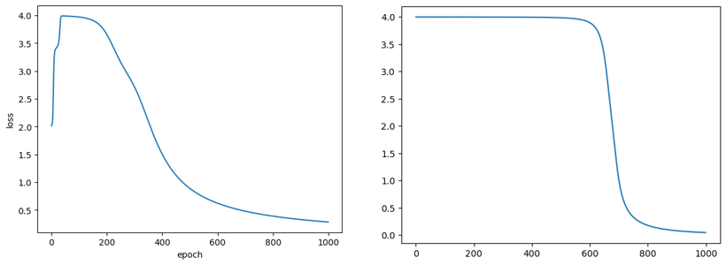

# DeepLearning2026

Python 기초부터 시작해 **NumPy만으로 신경망(퍼셉트론 · 다층 신경망)과 역전파를 직접 구현**하기까지 정리한 딥러닝 학습 노트입니다. TensorFlow 같은 프레임워크 없이 순전파 · 오차 계산 · 가중치 갱신을 행렬 연산으로 하나씩 작성했습니다.

<p align="center"></p>
<p align="center"><sub>XOR 학습 loss 곡선 (bipolar) · 왼쪽: 은닉층 1개 (2-2-1) · 오른쪽: 은닉층 2개 (2-2-2-1)</sub></p>

## 폴더 구성

### `neural_network/` — NumPy로 구현한 신경망

| 노트북 | 내용 |
|---|---|
| `01_perceptron_OR_unipolar` | 단층 퍼셉트론으로 **OR 게이트** 학습. 입력·출력 0/1, 시그모이드, 경사하강법(학습률 0.1), 오분류가 0이 되면 종료 |
| `02_perceptron_OR_bipolar` | 같은 문제를 입력·출력 −1/1과 **bipolar 시그모이드**(2/(1+e⁻ʸ) − 1)로 학습 |
| `03_perceptron_step_by_step_unipolar` | 01의 한 번의 학습 단계를 순전파 → 오차 → 델타 → dW·db → 갱신 순서로 셀마다 나눠 출력하며 확인 |
| `04_perceptron_step_by_step_bipolar` | 02를 같은 방식으로 한 단계씩 확인, 시그모이드 미분을 뺀 갱신과 비교 |
| `05_mlp_XOR_unipolar` | 단층으로는 풀 수 없는 **XOR**를 은닉층 1개(2-2-1)와 2개(2-3-3-1) 신경망으로 학습, **역전파 직접 구현**, loss 곡선 |
| `06_mlp_XOR_bipolar` | XOR를 bipolar 시그모이드로 학습 (2-2-1, 2-2-2-1). 은닉층을 늘리면 1,000 epoch 뒤 loss가 약 0.29 → 0.05로 감소 |
| `07_mlp_class` | 2-2-1 신경망을 `myModel` 클래스로 정리 (`prediction`, `fit`, `plotLosses`) |

### `python_basics/` — Python · NumPy · Matplotlib 기초

| 노트북 | 내용 |
|---|---|
| `01_jupyter_variables` | Jupyter 마크다운 · 수식, TensorFlow · OpenCV 설치 확인, 변수와 자료형, 문자열 인덱싱 |
| `02_strings_collections` | 문자열 메서드와 포맷팅, 리스트 · 튜플 · 딕셔너리 |
| `03_control_flow` | if / while / for, `enumerate`, `break` · `continue`, 구구단 |
| `04_functions_lambda` | 기본값 · 키워드 · 가변 인자, 여러 값 반환, `lambda` · `filter` · `map`, 소수 찾기 |
| `05_modules_classes` | 모듈 import(`myModule.py`), 클래스와 상속, `super()` |
| `06_operator_overloading_numpy` | 연산자 오버로딩(`__add__`, `__str__`), NumPy 배열 생성 · 불리언 인덱싱 · 브로드캐스팅 · 축별 집계 |
| `07_numpy_reshape_matplotlib_image` | `reshape` · `expand_dims`, Matplotlib 그래프(plot · hist · scatter · subplot), PIL · OpenCV로 이미지 읽기와 흑백 변환 · 히스토그램 |

## 신경망 구현 흐름

```
순전파    y1 = X·W1 + b1 → h = σ(y1) → y2 = h·W2 + b2 → ẑ = σ(y2)
출력층    δ2 = (ẑ − z) ⊙ σ'(ẑ)          dW2 = hᵀ·δ2 / N,  db2 = Σδ2 / N
은닉층    δ1 = (δ2·W2ᵀ) ⊙ σ'(h)         dW1 = Xᵀ·δ1 / N,  db1 = Σδ1 / N
갱신      W ← W − η·dW,  b ← b − η·db
```

## 실행 환경

Python 3, NumPy, Matplotlib (python_basics는 추가로 Pillow, OpenCV, TensorFlow 사용)

- `python_basics/01`과 `07`은 로컬 이미지 파일(`test2.png`, `wallpaper-696758.jpg`)을 읽습니다. 저장소에는 포함하지 않았으므로 아무 이미지로 바꿔 실행하면 됩니다.

## 배운 점과 개선할 점

- OR는 직선 하나로 나눌 수 있어 단층 퍼셉트론으로 풀리지만, XOR는 은닉층이 있어야 풀린다는 점을 직접 확인
- 입력을 0/1 대신 −1/1(bipolar)로 두면 0 입력에서도 가중치가 갱신되어 학습이 더 빨리 진행됨
- 은닉층 수와 학습률, 초기 가중치에 따라 수렴 속도가 크게 달라짐
- 개선할 점: bipolar 버전의 `sigmoid_derivative(y)`는 활성화 이전 값을 받도록 정의했지만 실제로는 활성화 이후 값(출력)을 넣고 있어, σ를 한 번 더 적용한 기울기가 쓰입니다. 출력값 기준 식 0.5·(1 − ẑ)(1 + ẑ)로 바꾸는 것이 정확합니다.
